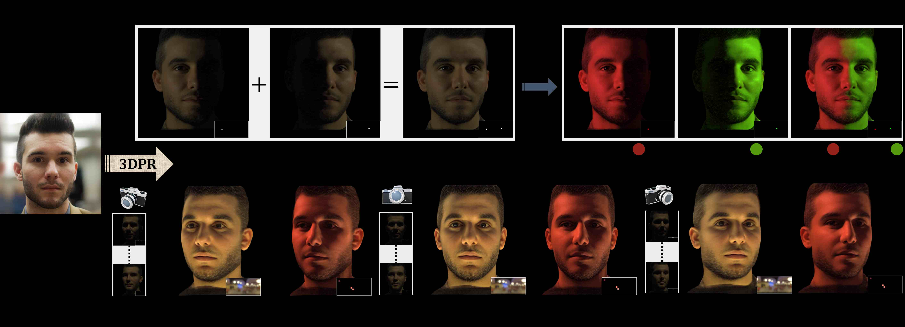

<p align="center">

  <h1 align="center">3DPR: Single Image 3D Portrait Relighting with Generative Priors
    <a href='https://dl.acm.org/doi/10.1145/3757377.3763962'>
    
    </a>
    <a href='https://vcai.mpi-inf.mpg.de/projects/3dpr/' style='padding-left: 0.5rem;'>
    
    <a href='https://arxiv.org/abs/2510.15846'>
    
    </a>
  </h1>
  <h2 align="center">ACM SIGGRAPH-Asia 2025 Conference Proceedings</h2>
  <div align="center">
  </div>
</p>
<p float="center">
  
</p>

This repository contains the official implementation for 3DPR: Single Image 3D Portrait Relighting with Generative Priors.

# Code coming soon...

# Dataset Repository

- FaceOLAT Dataset: https://github.com/prraoo/FaceOLAT

# Citation
If you find this work useful, please cite:
```
@article{prao20253dpr,
	title = {3DPR: Single Image 3D Portrait Relighting with Generative Priors},
	author = {Rao, Pramod and Meka, Abhimitra and Zhou, Xilong   and Fox, Gereon and B R, Mallikarjun and Zhan, Fangneng and Weyrich, Tim and Bickel, Bernd and Pfister, Hanspeter and Matusik, Wojciech and Beeler, Thabo and Elgharib, Mohamed and Habermann, Marc and Theobalt, Christian },
	booktitle = {ACM SIGGRAPH ASIA 2025 Conference Proceedings},
	year={2025}
}
```